> *Criteria* : **Arrival Time**
> *Mode* : **Non Pre-Emptive**

|**Process No** | **Arrival Time** |  **Burst Time** |  **Completion Time** | **TakeAway Time** | **Waiting Time** | **Res Time** |
| - | - | - | - | - | - | - |
| p1 | 0 | 2 | 2 | 2 | 0 | 0 |
| p2 | 1 | 2 | 4 | 3 | 1 | 1 |
| p3 | 5 | 3 | 8 | 3 | 0 | 0 |
| p4 | 6 | 4 | 12 | 6 | 2 | 2 |

```mermaid
gantt
        title FCFS
        dateFormat  s
        axisFormat %S
        section Process No
        p1     :a, 0 , 2s
        p2     :b, after a , 2s
        idle   :active, after b, 1s
        p3     :c, 5  , 3s
        p4     :after c , 4s
```

