> *Criteria* : **Priority**
> *Mode* : **Pre-Emptive**

|**Priority** |**Process No** | **Arrival Time** |  **Burst Time** |  **Completion Time** | **TakeAway Time** | **Waiting Time** |
| - | - | - | - | - | - | - |
|10| p1 | 0 | ~~5~~,~~4~~,0 | 12 | 12 | 7 |
|20| p2 | 1 | ~~4~~,~~3~~,0 | 8 | 7 | 3 |
|30| p3 | 2 | ~~2~~,~~1~~,0 | 4 | 2 | 0 |
|40| p4 | 4 | ~~1~~,0 | 5 | 1 | 0 |

```mermaid
gantt
        title PS
        dateFormat  s
        axisFormat %S
        section Process No
        p1     :0, 1s
        p2     :1, 1s
        p3     :2, 1s
        p3     :3, 1s
        p4     :4, 1s
        p2     :5, 3s
        p1     :8, 4s
```
