> *Criteria* : **Time Quantum**
> *Mode* : **Pre-Emptive**

|**Process No** | **Arrival Time** |  **Burst Time** |  **Completion Time** | **TakeAway Time** | **Waiting Time** | **Res Time** |
| - | - | - | - | - | - | - |
| p1 | 0 | ~~5~~,~~3~~,~~1~~,0 | 12 | 12 | 7 | 0 |
| p2 | 1 | ~~4~~,~~2~~,0 | 11 | 10 | 6 | 1 |
| p3 | 2 | ~~2~~,0 | 6 | 4 | 2 | 2 |
| p4 | 4 | ~~1~~,0 | 9 | 5 | 4 | 4 |

```mermaid
gantt
        title SRTF
        dateFormat  s
        axisFormat %S
        section Ready Queue
        p1     :0, 2s
        p2     :2, 2s
        p3     :4, 2s
        p1     :6, 2s
        p4     :8, 1s
        p2     :9, 2s
        p1     :11, 1s
        section Running Queue
        p1     :0, 2s
        p2     :2, 2s
        p3     :4, 2s
        p1     :6, 2s
        p4     :8, 1s
        p2     :9, 2s
        p1     :11, 1s
```

