> *Criteria* : **Burst Time**
> *Mode* : **Pre-Emptive**

|**Process No** | **Arrival Time** |  **Burst Time** |  **Completion Time** | **TakeAway Time** | **Waiting Time** | **Res Time** |
| - | - | - | - | - | - | - |
| p1 | 0 | ~~5~~,~~4~~,~~3~~,~~2~~,~~1~~,0 | 9 | 9 | 4 | 0 |
| p2 | 1 | ~~3~~,~~2~~,~~1~~,0 | 4 | 3 | 0 | 0 |
| p3 | 2 | ~~4~~,0 | 13 | 11 | 7 | 7 |
| p4 | 4 | ~~1~~,0 | 5 | 1 | 0 | 0 |

```mermaid
gantt
        title SRTF
        dateFormat  s
        axisFormat %S
        section Process No
        p1     :0, 1s
        p2     :1, 1s
        p2     :2, 1s
        p2     :3, 1s
        p4     :4, 1s
        p1     :5, 1s
        p1     :6, 1s
        p1     :7, 1s
        p1     :8, 1s
        p3     :9, 4s
```

