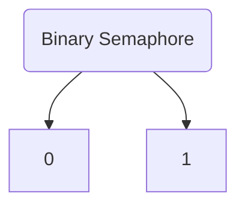

### Entry Section Code
```c
Down(Semaphore S){
	if(S.value == 1){
		S.value = 0; // Successful Operation
	} else { // Unsuccessful Operation
		Block this Process and place in Suspend List, Sleep(); 
	}
}
```
### Exit Section Code
```c
up(Semaphore S){
	if(Suspend List is empty){
		S.value = 1;
	} else{
		Select a Process from Suspend list and Wake Up();	
	}
}
```