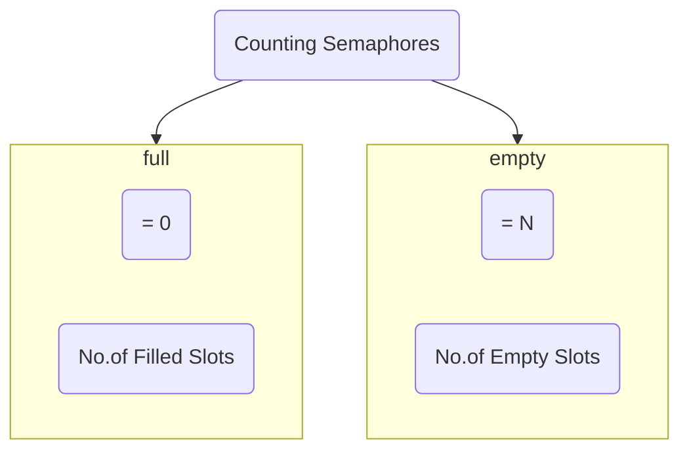

### Producer Code
```c
Produce_item(item P){
	down(Empty);
	down(S);
	Buffer[IN] = itemp;
	In = (In + 1) mod n;
	Up(S);
	Up(full);
}
```
### Consumer Code
```c
down(full);
down(S);
item C = Buffer[out];
out = (out + 1) mod n;
Up(S);
Up(Empty);
```