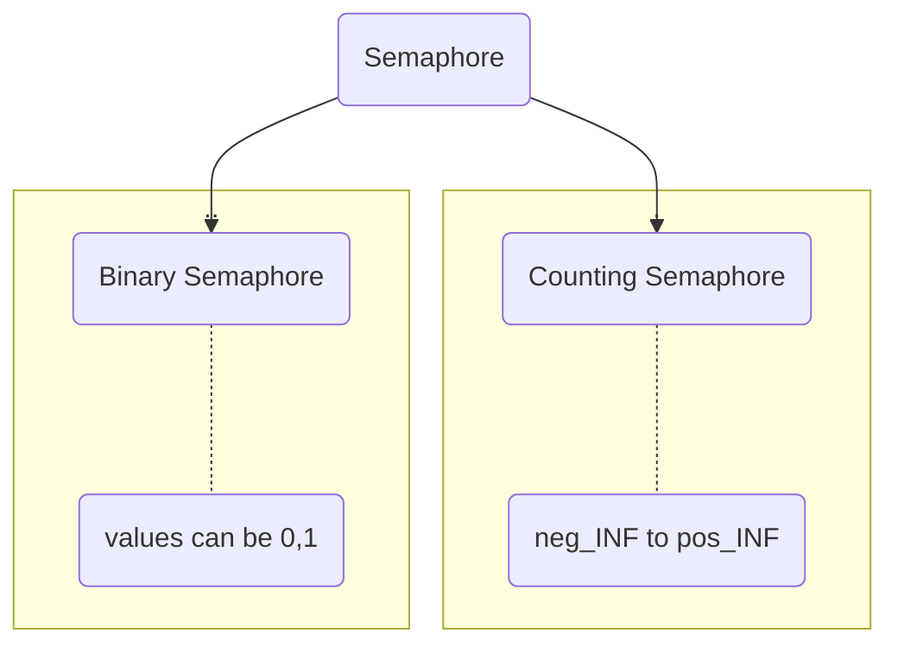

> Method / Tool which is used to prevent **Race Condtion**

>Semaphore is a integer variable used in **Mutual Exclusive Manner** by concurrent processes in order to acheive **Synchronization**.


#### Operations in Semaphores
- P()/ down/ wait                -------- > Entry Code
- V()/ up/ signal/ post        -------- >  Exit Code

### Entry Section Code
```c
down(Semaphore S){
	S.Value = S.Value - 1;
	if(S.value <= 0){
		Put Process(PCB) in Suspended List Sleep();
	} else return;
}
```
### Exit Section Code
```c
up(Semaphore S){
	S.value = S.value + 1;
	if(S.value <= 0){
		Select a Process from Suspended List Wake up();
	} else return;
}
```