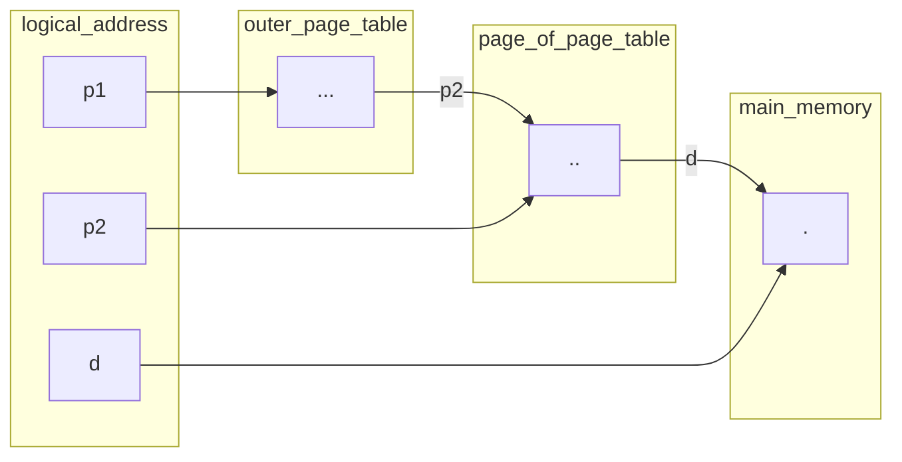

# Two-Level Paging

> Here, a condition if ***page table size is more than main memory***.
> we create another page table which has the entries of the above page table 
> 
> then, **new page table(outer_page_table)** size is ***comparable*** to main memory
> through which we can translate the address we need.

> [!NOTE] MULTI LEVEL PAGING
> If two levels of page table are not enough to allocate at main memory
> we further allocate more page table so as to decrease the size comparable to 
> main memory.
> so each preceding page tables are mapped to succeeding ones.

