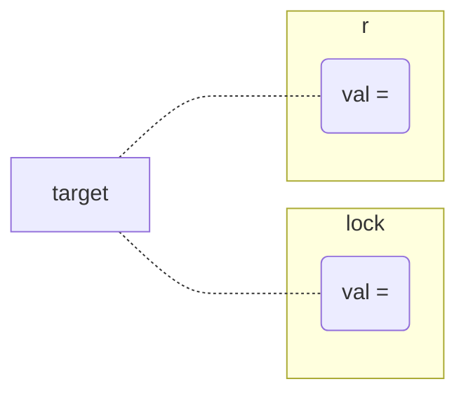

### Critical Section Solution using "Lock" Variable
![[Critical Section Solutions-drw|center]]
```c

do{
	acquire lock;
		CS;      // critical section
	release lock;
}

// meaning if Lock equals to 1 then it goes infinite loop untill its not 1
```

- Execute in **User Mode**
- Multi-Process Solution
- No Mutual Exclusion is guaranteed 

> Next Solution will Solve above problems

### Critical Section Solution using "Test and Set" Instruction
```c
while(test_and_set(&lock));
CS;    // critical section
lock = false;

bool test_and_set(bool *target){
	bool r = *target;
	*target = true;
	return r;
}
```


