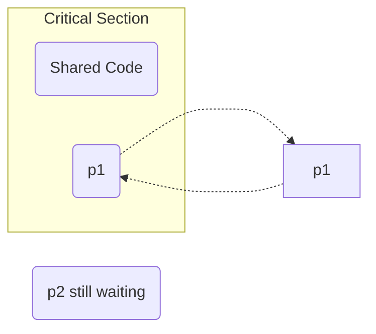

# Primary
# 1. Mutual Exclusion
![[Synchronization Mechanism-Mutual Exclusion|800]]

# 2. Progress

![[Synchronization Mechanism-Progress|800]]
> [!example] Progress
some kind of error in entry sections of both processes

# Secondary
# 3. Bounded Wait

> To avoid this we bound how many times p1 can execute
# 4. No Assumptions related to hardware or speed
> Example : If certain solution only run on 32bit system but not 64-bit system
> (or)
> If it runs in 1Ghz speed but not below

