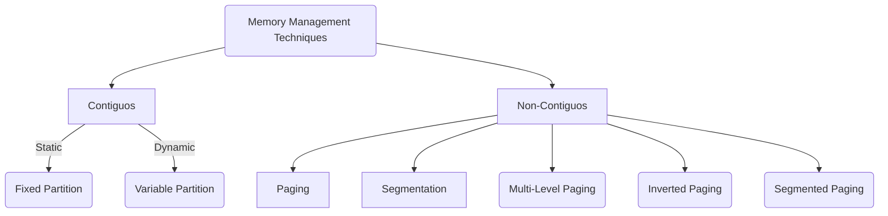

```mermaid
graph TD
a(Memory Management Techniques) --> Contiguos
a --> Non-Contiguos
Contiguos -->|Static| b(Fixed Partition)
Contiguos -->|Dynamic| c(Variable Partition)
Non-Contiguos --> Paging
Non-Contiguos --> Segmentation
Non-Contiguos --> d(Multi-Level Paging)
Non-Contiguos --> e(Inverted Paging)
Non-Contiguos --> f(Segmented Paging)
```

